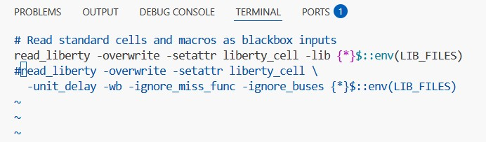
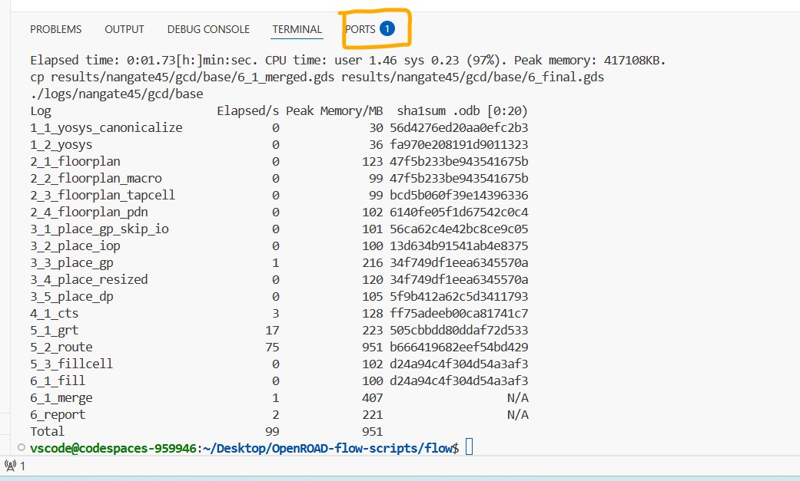
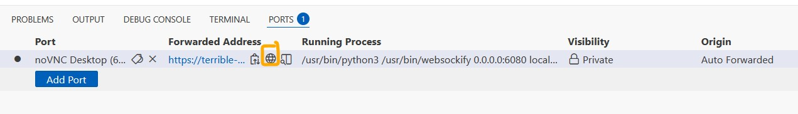
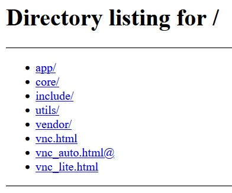

# VSD-PD Codespace  
**OpenROAD + noVNC Cloud Environment**

This repository launches a **ready-to-use GitHub Codespace** with OpenROAD tools, an XFCE desktop, and browser-based **noVNC** access.  
It is designed for testing and learning **physical design (PD) flows** in a cloud-based environment — without needing any local installation.

---

## 🚀 Launch the Codespace

1. Click **Code → Codespaces → Create codespace on main**  
   

2. Wait for the setup to complete.  
   The log will show: **“Finished configuring codespace.”**  
     
   

---

##  Run OpenROAD Flow Scripts

Once inside the Codespace terminal (or through the noVNC desktop terminal):

```bash
cd ~/Desktop
git clone https://github.com/The-OpenROAD-Project/OpenROAD-flow-scripts.git
cd OpenROAD-flow-scripts/flow
make
````

## If you encounter an error during synthesis, open the TCL file:

```bash
vim scripts/synth_stdcells.tcl
```

Comment out the second `read_liberty` line, as shown below:


Then rerun the flow:

```bash
make
```

When the process finishes successfully, you’ll see a log summary similar to this:


---

## 🖥️ Access the GUI via noVNC

1. Open the **PORTS** tab in the Codespace.
2. Click the 🌐 icon next to **port 6080** to open the noVNC desktop.
   

You’ll see the browser-based desktop environment:


---

## ⚠️ Important Notice

This Codespace setup uses the official
👉 [**OpenROAD Flow Scripts**](https://github.com/The-OpenROAD-Project/OpenROAD-flow-scripts)
from the **OpenROAD Project**.

It is intended **only for educational and testing purposes** as part of the **VSD Cloud Codespace Environment**.
For official documentation, updates, and support, please refer to the OpenROAD repository linked above.

```
