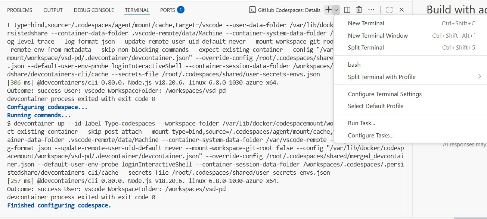

# VSD-PD Codespace  
**OpenROAD + noVNC Cloud Environment**

This repository launches a **ready-to-use GitHub Codespace** with OpenROAD tools, an XFCE desktop, and browser-based **noVNC** access.  
It is designed for testing and learning **physical design (PD) flows** in a cloud-based environment — without needing any local installation.

---

## 🚀 Launch the Codespace

1. Click **Code → Codespaces → Create codespace on main**  
   

2. Wait for the setup to complete.  
   The log will show: **“Finished configuring codespace.”**  
     
   

---

## 🧠 Run OpenROAD Flow Scripts

Once inside the Codespace terminal (or through the noVNC desktop terminal):

```bash
cd ~/Desktop
git clone https://github.com/The-OpenROAD-Project/OpenROAD-flow-scripts.git
cd OpenROAD-flow-scripts/flow
make
